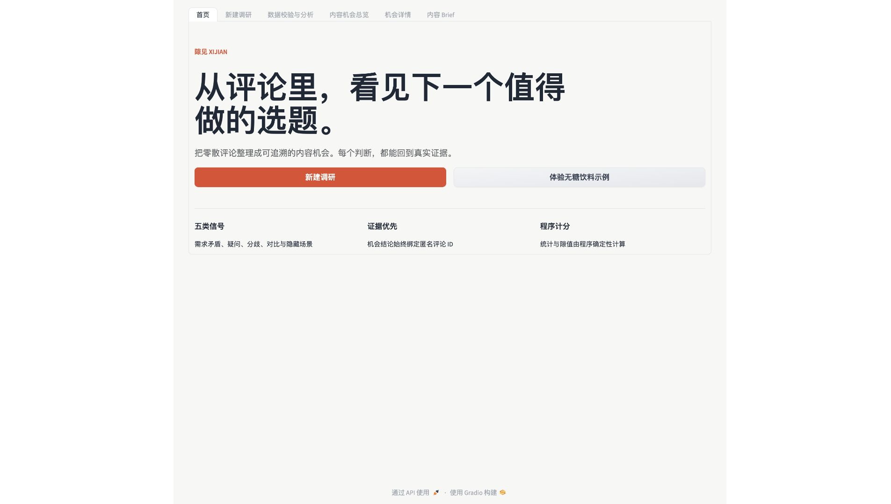
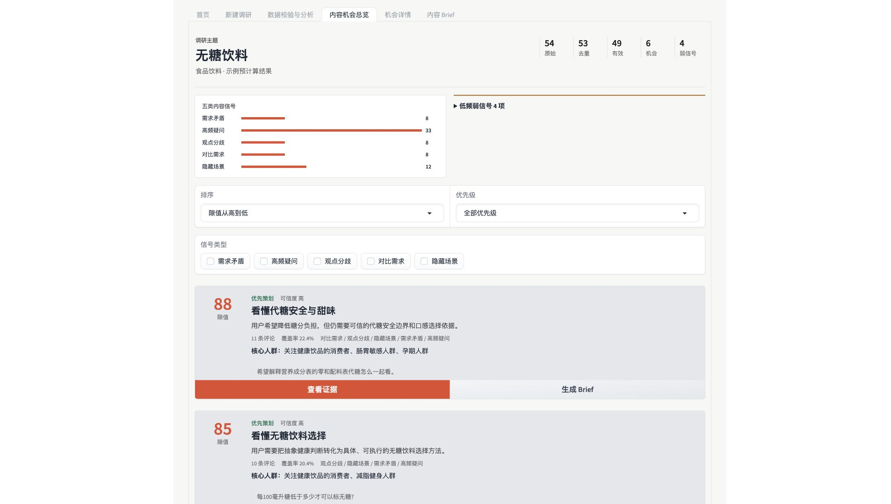

# 隙见 XIJIAN

> 从真实评论中发现值得创作的内容机会，并生成可追溯的选题 Brief。

[**在线体验：ModelScope 创空间 →**](https://modelscope.cn/studios/ii76ii/jianxi)


隙见是一款面向内容运营、市场研究和创作者的 AI 评论洞察工具。它把分散在评论区里的疑问、顾虑、争议和真实使用场景整理为可量化的内容机会，并让每条结论都能回到原始评论证据。

项目既支持 OpenAI 兼容的大模型接口，也提供无需 API Key 的本地降级分析与内置演示数据，便于本地体验、功能演示和离线验证。

## 核心能力

- **多来源评论导入**：支持 CSV、XLSX、粘贴文本和内置示例数据，自动识别常见评论字段。
- **数据清洗与质量检查**：处理 HTML、不可见字符、重复标点和重复评论，并识别纯数字、纯表情等低信息内容。
- **五类机会信号识别**：提取需求矛盾、高频疑问、观点分歧、对比需求和隐藏场景。
- **机会聚类与隙值评分**：结合评论数量、覆盖率、信号质量和五维评分生成内容机会优先级。
- **完整评论证据链**：每个机会都可回溯到匿名原始评论，支持强表达、高频疑问、不同观点和高赞证据筛选。
- **内容 Brief 生成**：为正式机会生成三份差异化方案，覆盖目标人群、切入角度、内容结构、核心观点、证据和风险提示。
- **稳定演示与任务恢复**：SQLite 保存任务、分析结果、机会与 Brief；无 API Key 时仍可运行本地分析和预计算示例。
- **结果导出与安全埋点**：支持复制标题、复制完整 Brief 和导出 Markdown；埋点仅记录安全元数据，不保存评论正文或密钥。

## 工作流程

```text
导入评论
   ↓
清洗、去重与质量检查
   ↓
识别五类内容信号
   ↓
聚类并计算机会隙值
   ↓
查看机会、评分与评论证据
   ↓
生成、编辑和导出内容 Brief
```

## 界面预览





## 快速开始

### 环境要求

- Python 3.10 或更高版本，推荐 Python 3.12
- macOS、Linux 或 Windows

### 安装与运行

```bash
git clone https://github.com/ii76/xijian.git
cd xijian

python3 -m venv .venv
source .venv/bin/activate
python -m pip install -r requirements.txt

cp .env.example .env
python app.py
```

Windows PowerShell 激活虚拟环境时使用：

```powershell
.venv\Scripts\Activate.ps1
```

启动后访问 [http://127.0.0.1:7860](http://127.0.0.1:7860)。首次体验可直接选择内置的“无糖饮料”示例，无需配置 API Key。

## AI 服务配置

项目通过环境变量连接 OpenAI 兼容的 `/chat/completions` 接口。复制 `.env.example` 为 `.env` 后按需填写：

```dotenv
LLM_API_KEY=
LLM_BASE_URL=
LLM_MODEL=
LLM_TIMEOUT=45
LLM_MAX_RETRIES=2
```

| 环境变量 | 是否必需 | 说明 |
|---|---|---|
| `LLM_API_KEY` | 否 | 模型服务密钥；留空时使用本地降级分析 |
| `LLM_BASE_URL` | 否 | OpenAI 兼容接口地址，默认 `https://api.openai.com/v1` |
| `LLM_MODEL` | 否 | 模型名称，默认 `gpt-4o-mini` |
| `LLM_TIMEOUT` | 否 | 单次请求超时秒数，默认 `45` |
| `LLM_MAX_RETRIES` | 否 | 请求失败后的最大重试次数，默认 `2` |
| `GRADIO_SERVER_NAME` | 否 | 服务监听地址，默认 `0.0.0.0` |
| `GRADIO_SERVER_PORT` | 否 | 服务端口，默认 `7860` |

真实密钥只能保存在本地 `.env` 或部署平台的密钥管理中，不要写入代码、日志或提交到版本库。

## 支持的数据格式

- CSV 文件
- XLSX 文件
- 每行一条评论的粘贴文本
- 项目内置演示数据

系统会尝试自动识别 `comment`、`content`、`text`、`评论内容` 等字段；自动识别失败时可以手动选择评论列。平台和点赞字段属于可选信息。

## 测试与发布检查

安装开发依赖并运行测试：

```bash
python -m pip install -r requirements-dev.txt
pytest -q
```

部署前检查目录结构和关键文件：

```bash
python scripts/check_deploy_layout.py
python scripts/validate_release.py
```

## Docker 部署

```bash
docker build -t xijian .
docker run --rm -p 7860:7860 --env-file .env xijian
```

容器默认监听 `0.0.0.0:7860`，并使用项目根目录的 `requirements.txt` 安装生产依赖。

## ModelScope 创空间部署

项目同时支持 Gradio SDK 和 Docker 创空间。上传时必须保持以下目录位于仓库根目录：`models/`、`pages/`、`services/`、`static/`、`data/` 和 `prompts/`。

发布前建议运行：

```bash
python scripts/check_deploy_layout.py
```

需要手动上传时，可以生成干净的部署包：

```bash
python scripts/build_modelscope_package.py
```

完整步骤和常见故障处理见 [ModelScope 部署说明](materials/DEPLOYMENT.md)。

## 项目结构

```text
xijian/
├── app.py                  # Gradio 应用入口与页面流程
├── models/                 # 任务、评论、信号、机会和 Brief 模型
├── pages/                  # 页面结构与展示组件
├── services/               # 导入、清洗、分析、聚类、评分和存储服务
├── prompts/                # AI 分析与 Brief 提示词
├── static/                 # 样式和品牌资源
├── data/demo/              # 内置演示数据及预计算结果
├── tests/                  # 自动化测试
├── scripts/                # 发布验证、统计和部署打包脚本
├── materials/              # 部署、测试和比赛交付材料
├── requirements.txt        # 生产依赖
└── Dockerfile              # 容器部署配置
```

## 设计原则

- **证据优先**：洞察和 Brief 必须能够回溯到真实评论。
- **程序负责数字**：评论数、覆盖率、隙值和优先级由代码计算，不交给模型猜测。
- **失败可见**：保留失败批次和错误原因，支持重试与重新分析。
- **离线可用**：未配置模型服务时，仍可完成本地分析和示例演示。
- **数据隔离**：新任务会清空上一任务的界面状态，不同数据集不会复用错误的预计算结果。
- **密钥不落库**：API Key 不进入页面状态、日志、SQLite 或 Git 仓库。

## 相关文档

- [部署指南](materials/DEPLOYMENT.md)
- [测试报告](materials/TEST_REPORT.md)
- [演示讲解脚本](materials/DEMO_SCRIPT.md)
- [人工标注说明](materials/ANNOTATION_GUIDE.md)
- [对照实验方案](materials/CONTROL_EXPERIMENT.md)

## 当前状态

项目已完成评论数据闭环、AI 分析、机会发现、证据追溯、Brief 生成、自动化测试、响应式界面优化和 ModelScope 部署适配。当前版本适合作为可运行的 MVP、比赛演示项目和评论洞察工作台原型。
